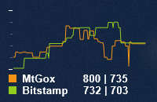

RainyBitcoinBRL
===============

Gráfico de Bitcoin baseado no RainyBitcoin para Rainmeter. Exibe dados do Mercado Bitcoin e Bitstamp.

### Instalação
- Copie a pasta RainyBitcoinBRL para sua pasta de skins do Rainmeter. (C:\Users\Usuário\Documentos\Rainmeter\Skins)
- Edite o arquivo Options.inc ao seu gosto
- ???
- Profit.

### Screenshots (RainyBitcoin original, mas whatever)
#### Basic

#### Minimal

#### Graph
